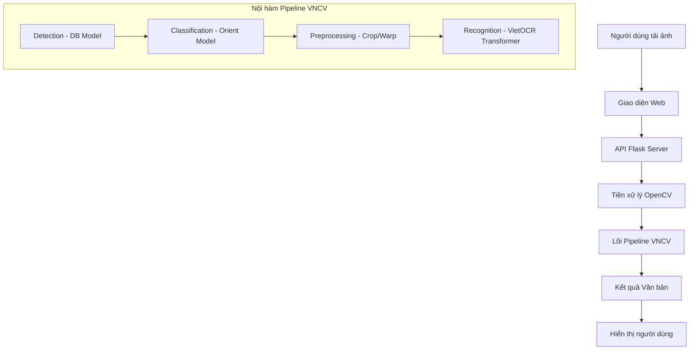

# CHƯƠNG 3: THIẾT KẾ VÀ CÀI ĐẶT HỆ THỐNG

## 3.1. Thiết kế quy trình xử lý dữ liệu (Sơ đồ & Luồng)

Hệ thống được thiết kế theo mô hình phân lớp, tách biệt giữa quá trình giao diện và lõi xử lý AI. Luồng dữ liệu đảm bảo tính toàn vẹn và tối ưu hóa trước khi đưa vào mô hình nhận diện.

### 3.1.1. Sơ đồ luồng dữ liệu tổng quát (Workflow Diagram)

Sơ đồ dưới đây mô tả hành trình của dữ liệu từ khi người dùng tải ảnh lên cho đến khi nhận được văn bản số hóa:

### 3.1.2. Phân tích các giai đoạn xử lý
1.  **Giai đoạn đầu vào (Input stage)**: Giao diện web nhận tệp tin hình ảnh thông qua hành vi kéo thả hoặc chọn file. Tại đây, Client-side thực hiện kiểm tra định dạng và kích thước ảnh trước khi đóng gói vào `FormData` để gửi tới Server.
2.  **Giai đoạn xử lý (Processing stage)**: 
    -   **Backend**: Flask nhận ảnh, lưu tạm thời vào hệ thống tệp tin và gọi các hàm xử lý ảnh số.
    -   **Tiền xử lý**: Sử dụng các thuật toán OpenCV để loại bỏ nhiễu, tăng độ phân giải và hiệu chỉnh độ nghiêng (Deskew). Đây là bước then chốt giúp tăng độ chính xác của AI từ 20-30%.
    -   **Pipeline VNCV**: Thực hiện nhận diện theo quy chuẩn 3 lớp: Tìm vùng chữ -> Phân loại hướng -> Giải mã ký tự tiếng Việt.
3.  **Giai đoạn đầu ra (Output stage)**: Kết quả từ mô hình AI là một danh sách các chuỗi văn bản. Hệ thống sẽ chuẩn hóa dữ liệu này về định dạng JSON và trả về cho trình duyệt để hiển thị trực quan cho người dùng.

---

## 3.2. Cài đặt môi trường phát triển

Để hệ thống vận hành ổn định và đạt hiệu năng tốt nhất, môi trường phát triển được cấu hình như sau:

### 3.2.1. Nền tảng và Ngôn ngữ
-   **Hệ điều hành**: Microsoft Windows 10/11.
-   **Ngôn ngữ lập trình**: Python phiên bản 3.10 hoặc mới hơn.
-   **Quản lý môi trường**: Sử dụng Virtual Environment (`venv_vncv`) để cô lập các phụ thuộc (dependencies), tránh xung đột thư viện hệ thống.

### 3.2.2. Danh sách thư viện và vai trò
| Thư viện | Phiên bản | Vai trò chính |
| :--- | :--- | :--- |
| **Flask** | 3.0.0+ | Xây dựng dịch vụ Web API. |
| **OpenCV-Python** | 4.8.0+ | Xử lý ảnh số (Khử nhiễu, Xoay ảnh, CLAHE). |
| **VNCV** | Latest | Thư viện lõi chứa logic điều phối OCR. |
| **ONNX Runtime** | 1.16.0+ | Môi trường thực thi các mô hình AI đã nén (.onnx). |
| **NumPy** | 1.24.0+ | Xử lý mảng dữ liệu ảnh và tính toán hình học. |

### 3.2.3. Các tệp tin mô hình lưu trữ (Weights)
Các trọng số của mô hình được đóng gói dưới định dạng ONNX để tối ưu tốc độ thực thi trên CPU:
-   `detection.onnx`: Chứa mô hình DB (Differentiable Binarization) dùng để xác định tọa độ vùng chứa chữ.
-   `classification.onnx`: Mô hình phân loại hướng ảnh (0 độ hoặc 180 độ) để đảm bảo chữ không bị ngược.
-   `model_encoder.onnx` & `model_decoder.onnx`: Bộ đôi kiến trúc Transformer chuyên biệt cho tiếng Việt.
-   `vocab.json`: Từ điển bộ ký tự tiếng Việt chuẩn (Unicode).

---

## 3.3. Giải thích mã nguồn cốt lõi

Phần này phân tích logic xử lý bên trong thư viện `vncv` và các module hỗ trợ.

### 3.3.1. Điều phối hệ thống (Pipeline Orchestration - `ocr.py`)
Mã nguồn trong `ocr.py` thực hiện vai trò điều phối các thành phần. Hàm quan trọng nhất là `extract_text`:
-   **Logic xử lý**: Nhận đường dẫn ảnh -> Gọi mô hình `Detection` để lấy danh sách các đa giác (polygons) bao quanh chữ -> Sắp xếp thứ tự đọc -> Cắt nhỏ ảnh theo từng dòng -> Qua mô hình `Classification` -> Cuối cùng đưa vào `Recognition`.
-   **Kỹ thuật Sắp xếp (`sort_polygon`)**: Do AI thường phát hiện các vùng chữ không theo thứ tự đọc tự nhiên, hàm này thực hiện sắp xếp dựa trên tọa độ Y (dòng) và X (cột) với ngưỡng sai số 10 pixel để đảm bảo văn bản đầu ra đúng ngữ cảnh bản gốc.
-   **Kỹ thuật Cắt ảnh (`crop_image`)**: Sử dụng phương pháp biến đổi phối cảnh (`getPerspectiveTransform`). Nếu ảnh bị nghiêng, thuật toán sẽ tự động "nắn thẳng" vùng chữ về hình chữ nhật chuẩn trước khi nhận diện.

### 3.3.2. Kiến trúc nhận diện Tiếng Việt (`vietocr_onnx.py`)
Lõi nhận diện sử dụng kiến trúc **Transformer (Encoder-Decoder)**, một trong những kiến trúc tiên tiến nhất hiện nay:
-   **Bộ mã hóa (Encoder)**: Kết hợp giữa mạng CNN (ResNet) để trích xuất các đặc trưng hình ảnh của dòng chữ. Ảnh đầu vào luôn được chuẩn hóa về chiều cao 32 pixel để duy trì tỉ lệ đặc trưng.
-   **Bộ giải mã (Decoder)**: Sử dụng cơ chế Attention để "tập trung" vào từng vùng đặc trưng hình ảnh tương ứng với từng ký tự.
-   **Giải thuật Greedy Search**: Tại mỗi bước giải mã, hệ thống chọn ký tự có xác suất xuất hiện cao nhất từ bộ từ điển `vocab.json` cho đến khi gặp ký tự kết thúc (EOS).

### 3.3.3. Tiền xử lý bổ trợ nâng cao (`test_vncv.py` / `app.py`)
Để hỗ trợ mô hình làm việc tốt hơn với ảnh mờ hoặc nhiễu, hệ thống cài đặt các bước bổ trợ:
1.  **FastNlMeansDenoising**: Khử nhiễu hạt sắc nét mà vẫn giữ được cạnh của ký tự.
2.  **Upscaling**: Sử dụng nội suy Cubic để tăng kích thước ảnh lên 2 lần, giúp các nét chữ mảnh trở nên rõ ràng hơn đối với AI.
3.  **Deskewing (Chỉnh nghiêng tự động)**: Sử dụng thuật toán `Canny` để tìm lưới văn bản, sau đó tính toán góc nghiêng tối ưu bằng `minAreaRect` và xoay ảnh bằng ma trận xoay 2D. Kỹ thuật này giúp hệ thống xử lý được các ảnh chụp bị lệch camera.
4.  **CLAHE**: Thay vì nhị phân hóa (đen trắng) làm mất chi tiết, hệ thống dùng thuật toán cân bằng biểu đồ mức xám thích nghi để làm nổi bật vùng chữ trong điều kiện thiếu sáng.
